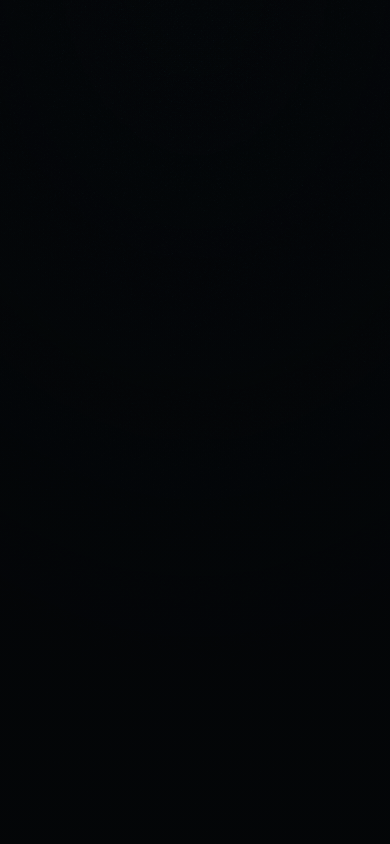
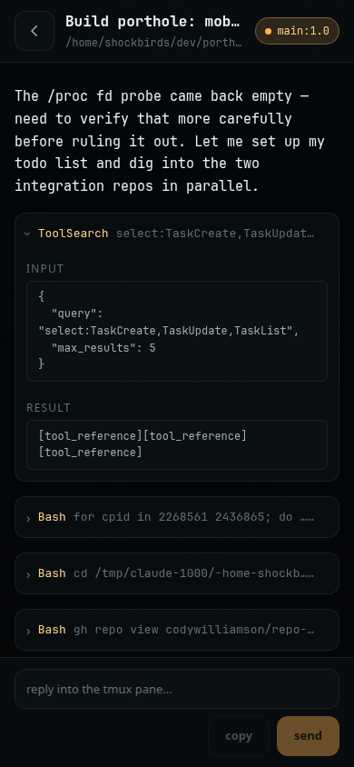

# porthole

Mobile-first web viewer and reply relay for Claude Code sessions running in tmux, served
over Tailscale. Review long responses on your phone, jump between sessions, and reply
into the right terminal.

<p align="center">
  
  
</p>

## features

- all sessions across all projects, one list
- live transcript over SSE — no reloads, no polling the browser
- tool calls folded into collapsed blocks so bash output doesn't flood your phone
- reply goes into the exact tmux pane (bracketed paste, multiline-safe)
- resume a dead session in a new tmux window
- drafts persist in localStorage

## quickstart

Prereqs: [bun](https://bun.sh), tmux, tailscale (gh only needed for repo ops).

```sh
bun install
bun run build   # builds the web/ SPA into dist/
bun start       # serves API + SSE + dist/ on Bun.serve
```

Open `http://<tailnet-hostname>:4747`.

Dev mode (two processes):

```sh
bun run dev      # backend, port 4747
bun run dev:web  # vite dev server, proxies /api to the backend
```

## env vars

| var | default | notes |
|---|---|---|
| `PORTHOLE_HOST` | `0.0.0.0` | bind wide so the tailnet reaches it |
| `PORTHOLE_PORT` | `4747` | |
| `PORTHOLE_POLL_MS` | `2000` | fallback poll interval when fs watch doesn't fire |
| `PORTHOLE_PROJECTS_DIR` | `~/.claude/projects` | where Claude Code writes session jsonl |
| `PORTHOLE_ALLOWED_HOSTS` | empty (any) | comma-separated `host:port` allowlist, dns-rebinding defense |

## architecture

`transcript` discovers sessions and parses jsonl into typed events; `activity` correlates
those sessions with running tmux panes/processes to figure out what's active and where;
`tmux` is the only module that spawns tmux, argv-only, and handles injection + resume;
`server` is a thin `Bun.serve` route map (session list, SSE stream, send, resume) that
also serves the built SPA; `web/` is the Vue 3 frontend. `shared/types.ts` is the api
contract both sides import — never redefined.

## security model

Tailscale is the perimeter — there's no auth by design. The bind is wide (`0.0.0.0`) so
anything on your tailnet can reach it; don't port-forward this to the open internet.
Cross-site POSTs are still blocked (origin check + required `application/json`
content-type), and `PORTHOLE_ALLOWED_HOSTS` hardens the Host header against DNS
rebinding if you want it.

## optional: ntfy Stop-hook

Add a Claude Code `Stop` hook that curls your [ntfy](https://ntfy.sh) topic so your phone
buzzes when a session finishes responding — porthole link in hand. Example
`~/.claude/settings.json`:

```json
{
  "hooks": {
    "Stop": [
      {
        "hooks": [
          {
            "type": "command",
            "command": "curl -s -d \"session $CLAUDE_SESSION_ID done\" ntfy.sh/<your-topic>"
          }
        ]
      }
    ]
  }
}
```

## assumptions

- built/tested against Claude Code 2.1.x jsonl format, on linux
- active-session detection walks `/proc`, so it's linux-only
- session titles prefer the `ai-title` event when present, falling back to the first
  real user message
